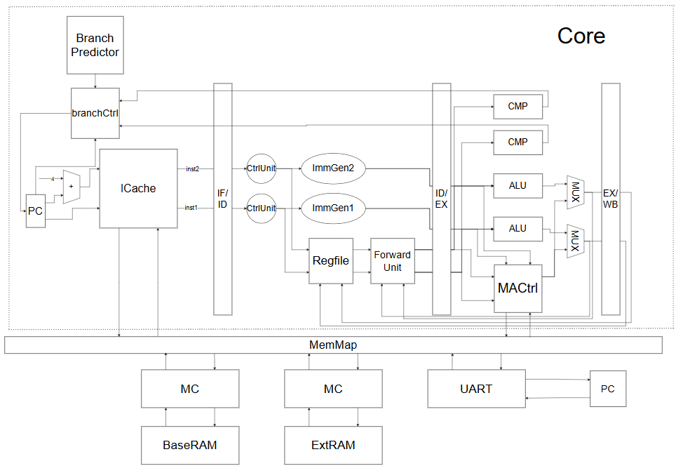

# nscscc24_single_loongarch

## Project Introduction

This repository contains a project that won the second prize in the individual competition of the 8th "Loongson Cup" National Undergraduate Computer System Capability Cultivation Competition (2024) for the LoongArch instruction set. The project is a LoongArch micro-system that supports 34 of the la32r instructions required by the competition. It uses two external SRAMs on the Loongson experimental kit as memory for reading and writing and can interact with a PC via a UART serial port. The system consists of a Core with a dual-issue four-stage in-order pipeline supporting dynamic branch prediction, an instruction Cache, and two memory driver modules supporting store buffers. The system runs at a maximum frequency of 110MHz without timing violations.

To prevent the project from being used directly in competitions, some modules have been removed from the repository. Only the designs for the most core modules—Core, ICache, and iMC—are retained, located in `Core2.v`, `ICache2.v`, and `iMC.v` respectively.

## System Functions

The system supports 34 la32r instructions, as follows:

- Arithmetic: `add.w`, `sub.w`, `addi.w`, `lu12i.w`, `slt`, `sltu`, `slti`, `sltui`, `pcaddu12i`, `andi`, `and`, `or`, `ori`, `xor`, `mul.w`
- Shift operations: `sll.w`, `srl.w`, `sra.w`, `srli.w`, `slli.w`, `srai.w`
- Transfer instructions: `beq`, `bne`, `bge`, `blt`, `bltu`, `bgeu`, `b`, `bl`, `jirl`
- General memory access: `st.w`, `ld.w`, `st.b`, `ld.b`

The system supports only one privilege mode and does not support interrupt/exception handling or virtual memory.

## Design Solution

The microarchitecture is implemented as a dual-issue in-order pipeline. Two identical data paths are provided for the dual-issue CPU. For control, to ensure in-order execution, if the instruction in the first lane is stalled at a certain stage, the instruction in the second lane must also be stalled and wait for the first to complete. Instructions from the previous stage can only enter the current stage when neither lane is stalled. In the fetch stage, two instructions can proceed to the next stage together only if both result in a cache hit. For memory operations, strong ordering must be guaranteed; therefore, when both lanes require memory access, the second lane must wait for the first lane's memory access to complete. For each lane, referring to the classic five-stage pipeline structure, I merged the EX and MEM stages to eliminate load-use stalls and further improve IPC, resulting in a four-stage pipeline structure. The final result is a dual-issue four-stage in-order pipeline microarchitecture. For branch prediction, I used a classic two-bit branch predictor to record branch history, combined with a BTB to record target jump addresses. The entire microarchitecture is implemented as the `Core` module.

In the storage section, to improve IPC, I implemented an instruction cache to buffer recently accessed instructions. When an instruction cache miss occurs, a read request is sent. During memory access, the Core sends read/write requests. These three types of requests are mapped to the UART driver and the drivers for the two SRAMs (MC or iMC) via a `MemMap` structure based on the access address. The UART driver provided by the competition is used. The memory access drivers control the multi-cycle access logic; to support asynchronous writes, I designed store buffers within the storage drivers. The overall architecture diagram of the LoongArch micro-system is shown below.

## Design Results

The system can run at 110MHz without timing violations. If timing violations are ignored, it can pass tests at a maximum of 174MHz. The performance test results for the two configurations are as follows:

174MHz, three-cycle memory access, one-cycle stall for multiplication:

| STREAM | MATRIX | CRYPTONIGHT | Total |
| --- | --- | --- | --- |
| 0.032s | 0.077s | 0.157s | 0.266s |

110MHz, two-cycle memory access, two-cycle stall for multiplication:

| STREAM | MATRIX | CRYPTONIGHT | Total |
| --- | --- | --- | --- |
| 0.043s | 0.105s | 0.224s | 0.372s |

## Future Outlook

- Performance Perspective: Frequency can be further increased by adding pipeline stages or adjusting Vivado parameters; alternatively, allowing moderate out-of-order execution in the microarchitecture backend could improve IPC.
- Functional Perspective: Logic for interrupt/exception handling and virtual memory management could be added, and more la32r instructions could be supported to allow the system to handle more complex functions or even run an operating system.

## Reference Materials

1. David A. Patterson, John L. Hennessy, "Computer Organization and Design: The Hardware/Software Interface (RISC-V Edition)" [M]. Beijing: China Machine Press, 2020.
2. Yao Yongbin, "Superscalar Processor Design" [M]. Beijing: Tsinghua University Press, 2014.
3. "2023041918122813624. LoongArch 32-bit Reduced Reference Manual_r1p03"
4. Zhejiang University Computer Organization and Design course experiments.
