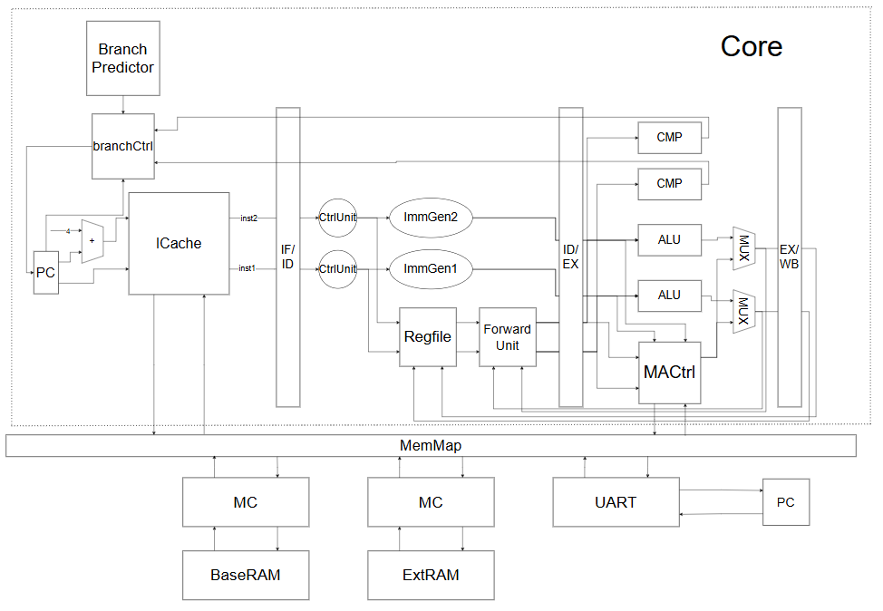

# nscscc24_single_loongarch

## 设计简介

本仓库为 2024 年第八届“龙芯杯”全国大学生计算机系统能力培养大赛，LoongArch 指令集个人赛二等奖参赛作品。作品为一个 LoongArch 微系统，支持大赛要求的 34 条 la32r 指令，其将龙芯实验箱中的两块外部 SRAM 作为内存进行读写，能通过 UART 串口与 PC 交互。系统由一个双发射四级顺序流水线，支持动态分支预测的 Core，一个指令 Cache，两个支持store buffer 的内存驱动模块组成。系统在不产生时序违例的情况下最高运行在 110MHz。

为防止直接将工程用于比赛，仓库中会删除部分模块，仅保留最核心的 Core, ICache, iMC 三个模块的设计。

## 系统功能

系统支持 34 条 la32r 指令，如下

- 算术运算类：add.w, sub.w, addi.w, lu12i.w, slt, sltu, slti, sltui, pcaddu12i, andi, and, or, ori, xor, mul.w
- 移位运算类：sll.w, srl.w, sra.w, srli.w, slli.w, srai.w
- 转移指令：beq, bne, bge, blt, bltu, bgeu, b, bl, jirl
- 普通访存指令：st.w, ld.w, st.b, ld.b

系统只支持一种特权模式，不支持中断异常处理，不支持虚拟内存。

## 设计方案

系统的微架构部分考虑使用双发射顺序流水线实现，为双发射 CPU 提供两条完全相同的数据通路，在控制上，为了保证顺序执行，对某一级，若第一路指令被阻塞，则第二路指令也需要被阻塞等待第一路指令执行完成，只有当一级中两路指令都不阻塞时前一级两条指令才能进入。对于取指令阶段只有当两条指令都命中时才能一起进入到下一级中执行。对于访存操作，必须保证强顺序，所以当两路指令都需要访存时第二路必须等待第一路的指令访存完成。对于每一路，参考经典的五级流水线结构，为了消除 load-use 停顿进而进一步提高 IPC，我将经典结构中的 EX 级和 MEM 级合并，从而得到四级流水线的结构，最后得到双发射四级顺序流水线的微架构。对于分支预测，我使用了经典的两位分支预测器来记录分支的历史，并配合 BTB 记录跳转的目的地址。整个微架构实现为 Core 模块。

在存储部分，为了提高 IPC，我实现了指令缓存（instruction cache）来缓存最近访问过的指令。当指令缓存失配时会发送读指令请求，以及访存时 Core 会发送读写请求，此时三种请求会通过 MemMap 结构根据访问的地址映射到串口驱动和两块 SRAM 的驱动（MC or iMC）中。串口驱动则使用大赛提供的驱动，访存驱动则控制多周期访存的逻辑，为了支持异步写，我在存储驱动中设计了 store buffer 以支持异步写。最后整个 LoongArch 微系统的架构图如下所示。
"

## 设计结果

在不产生时序违例的情况下系统能运行在 110MHz，若不考虑时序违例，最高能在 174MHz 通过测试，两种配置在性能测试中的成绩如下。

174MHz， 三周期访存，乘法一周期停顿：

| STREAM | MATRIX | CRYPTONIGHT | Total |
| --- | --- | --- | --- |
| 0.032s | 0.077s | 0.157s | 0.266s |

110MHz 两周期访存，乘法两周期停顿： 

| STREAM | MATRIX | CRYPTONIGHT | Total |
| --- | --- | --- | --- |
| 0.043s | 0.105s | 0.224s | 0.372s |

## 设计展望

- 性能角度：可以增加流水级，调整 vivado 参数等进一步提高频率；或尝试在微架构后端允许适当乱序以提高 IPC。
- 功能角度：可以为系统添加中断异常处理，虚拟内存管理等逻辑，支持更多 la32r 指令，使得系统支持更复杂的功能甚至跑起操作系统。

## 参考资料

1. 戴维·A. 帕特森, 约翰·L.亨尼斯 《计算机组成与设计 硬件/软件接口（RISC-V 版）》 [M]. 北京：机械出版社，2020 年
2. 姚永斌. 《超标量处理器设计》[M]. 北京：清华大学出版社，2014 年
3. 《2023041918122813624.龙芯架构 32 位精简版参考手册_r1p03》 
4. 浙江大学计算机组成与设计课程实验。